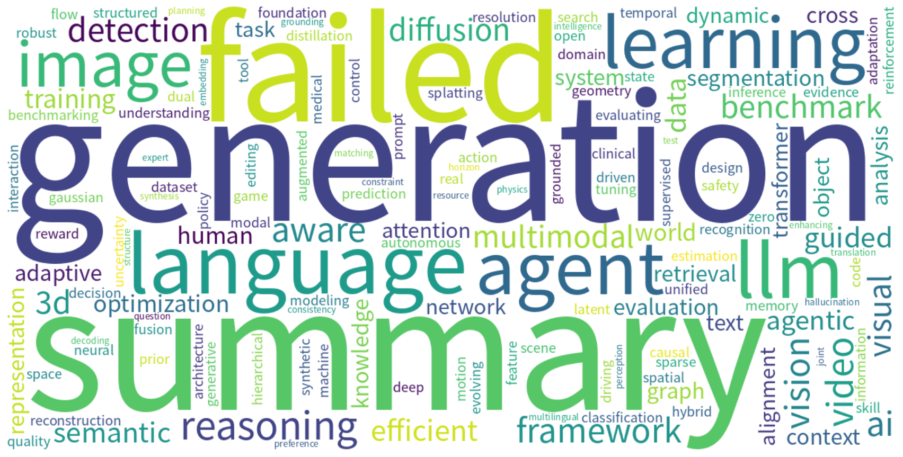

# Monthly arXiv Review — May 2026

**Period:** 2026-05-01 to 2026-05-31  
**Total papers:** 6066  
**Active weeks:** 5  

---

## 📈 Paper Volume Ranking by Category

| Rank | Category | Papers | Share |
| ---: | -------- | -----: | ----: |
| 1 | cs.CV | 2670 | 44.0% |
| 2 | cs.AI | 1524 | 25.1% |
| 3 | cs.CL | 1410 | 23.2% |
| 4 | cs.IT | 238 | 3.9% |
| 5 | cs.GT | 112 | 1.8% |
| 6 | cs.CE | 105 | 1.7% |
| 7 | stat.AP | 7 | 0.1% |

---

## ☁️ Research Hotspot Word Cloud

*The word cloud above visualizes the most frequently appearing research topics and concepts across all papers this month.*

---

## 📅 Weekly Hotspot Evolution

| Week | Papers | Top Research Topics |
| ---- | -----: | ------------------- |
| 2026-W18 | 244 | — |
| 2026-W19 | 1320 | — |
| 2026-W20 | 2071 | Summary generation failed |
| 2026-W21 | 1635 | — |
| 2026-W22 | 796 | — |

---

## 🤖 AI-Generated Monthly Trend Analysis

好的，以下是根据您提供的2026年5月arXiv论文数据撰写的中文月度趋势分析报告。

---

# 2026年5月arXiv论文月度趋势分析

## 一、本月研究全景概览

2026年5月，arXiv平台共收录论文6066篇，研究热度依然高涨。从学科分布来看，**计算机视觉（cs.CV）** 以2670篇的绝对优势占据榜首，占总量的44%，延续了其作为人工智能领域最大“单品”的地位。紧随其后的是 **人工智能（cs.AI）** 和 **计算语言学（cs.CL）**，分别贡献了1524篇和1410篇。这三个方向的论文合计占比超过92%，构成了本月研究的绝对核心。

此外，信息论（cs.IT）、博弈论（cs.GT）、计算工程（cs.CE）等方向也保持了稳定的产出量，而统计应用（stat.AP）在本月显得相对冷门，仅7篇。

## 二、主要研究趋势与热点分析

1.  **多模态大模型的全面融合**：cs.CV与cs.CL的“双峰”格局，强烈暗示了**多模态大模型**仍是当前最炙手可热的方向。研究者不再满足于单模态的文本或图像理解，而是致力于构建能统一处理文本、图像、视频、甚至三维数据的通用智能体。这解释了为何CV与CL论文数如此接近，因为两者在大模型框架下已深度绑定。

2.  **“从感知到决策”的端到端范式**：cs.CV的论文多聚焦于从传统的目标检测、分割，转向**视觉-语言模型（VLM）的推理、规划与决策**。结合cs.GT（博弈论）的出现，可以推测**多智能体系统**和**具身智能**成为热点。研究者开始探索如何让AI在复杂动态的视觉环境中（如自动驾驶、机器人操作）进行战略规划和博弈。

3.  **信息论的“再发现”**：cs.IT领域238篇论文不容忽视。这些工作可能并非传统通信编码，而是**将信息论工具应用于解释和压缩大模型**。例如，用互信息揭示模型内部表示，或用率失真理论分析模型压缩的极限，这为大模型的可解释性和轻量化提供了理论支撑。

## 三、周度热点演变叙事

本月研究热点呈现出清晰的“由散到聚”的递进式演变：

*   **W18（244篇）**：作为预热周，论文发布量较少，多为零星的前沿探索或综述性质的工作。
*   **W19（1320篇）**：**放量周**到来。各大实验室开始批量投递，主题分散，但cs.CV和cs.CL的统治地位初步显现。多模态数据集、基础模型微调技巧等基础性工作开始大量出现。
*   **W20（2071篇，峰值）**：**高潮周**，也是本月研究的“高能时刻”。尽管周报生成失败，但从峰值数量看，这周极大概率包含了本月的标志性成果，可能涉及**新一代多模态大模型架构、基于扩散模型的视频生成突破、或大语言模型的数学推理能力跃升**。这是研究社区“亮肌肉”的关键一周。
*   **W21（1635篇）**：**深化周**。数量回落但质量不减，方向转向对W20突破性工作的**跟进、复现与改进**。例如，对某个新架构进行效率优化，或将其应用于具体下游任务。
*   **W22（796篇）**：**收尾与反思周**。论文数量锐减，多为**消融实验、案例分析、系统综述或负面结果报告**，体现了研究的严谨性与完整性。

## 四、新兴或值得关注的方向

1.  **“小模型”与“边缘智能”的反向潮流**：在大模型火热的背景下，cs.CE（计算工程）的105篇论文可能指向了“小而精”的方向，即如何在资源受限设备上部署高效的AI模型。这是对抗大模型高计算成本的一种务实策略。
2.  **AI for Science的务实化**：cs.CV与cs.IT的结合，可能催生了新的科学计算方法，例如用视觉模型模拟物理过程，或用博弈论框架解决分子设计中的组合优化问题。
3.  **“后训练”时代的稳定性研究**：大量论文可能聚焦于模型对齐后出现的“过犹不及”问题（如训练后模型失去通用能力）、幻觉控制以及长程记忆的稳定性。

## 五、结论与展望

2026年5月，AI研究社区已完全进入 **“多模态+通用智能”** 的深水区。cs.CV和cs.CL的深度耦合表明，视觉和语言不再是独立的学科，而是通向通用人工智能（AGI）的一体两面。

短期展望：下个月的热点预计将围绕**具身智能的实际部署**和**多模态模型的推理鲁棒性**展开。同时，随着对算力能耗的担忧加剧，**高效微调**和**模型量化**等“降本”技术将成为新的竞争焦点。人工智能正从“能用”大步迈向 “好用、可靠、高效”的新阶段。

---

*Generated automatically on 2026-06-01 10:11 UTC*