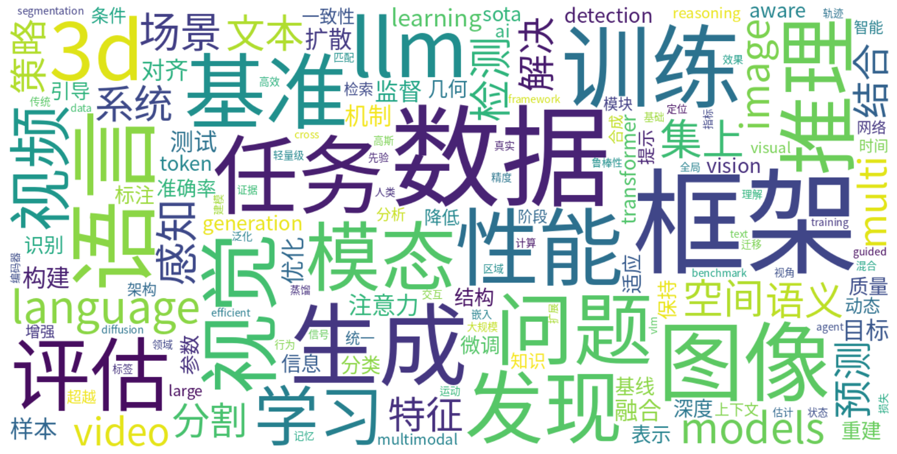

# Monthly arXiv Review — July 2026

**Period:** 2026-07-01 to 2026-07-31  
**Total papers:** 3724  
**Active weeks:** 5  

---

## 📈 Paper Volume Ranking by Category

| Rank | Category | Papers | Share |
| ---: | -------- | -----: | ----: |
| 1 | cs.CV | 2549 | 68.4% |
| 2 | cs.CL | 1174 | 31.5% |
| 3 | eess.IV | 1 | 0.0% |

---

## ☁️ Research Hotspot Word Cloud

*The word cloud above visualizes the most frequently appearing research topics and concepts across all papers this month.*

---

## 📅 Weekly Hotspot Evolution

| Week | Papers | Top Research Topics |
| ---- | -----: | ------------------- |
| 2026-W27 | 586 | 4D场景理解与感知 · 多模态融合感知 · 域自适应与迁移学习 · 大语言模型评估与校准 · 生成式AI安全与审计 |
| 2026-W28 | 801 | 3D场景理解与占用预测 · 视频多模态大模型细粒度感知 · 可解释机器学习与神经影像预测 · 神经渲染与稀疏视角重建 · 多模态LLM推理与一致性 |
| 2026-W29 | 790 | 大语言模型对齐与未对齐 · 知识图谱事实验证 · 3D场景重建 · 多模态大语言模型 · 模型权重谱结构分析 |
| 2026-W30 | 762 | Face expression recognition methods comparison · AI-generated video detection · Open-vocabulary 3D point cloud segmentation · Multimodal LLM part-level localization · Unified text-based clinical prediction |
| 2026-W31 | 785 | 多模态大语言模型安全 · LLM评估框架 · 医学图像分割 · AI生成内容检测 · 视觉语言模型推理 |

---

## 🤖 AI-Generated Monthly Trend Analysis

# 2026年7月arXiv论文月度综述

## 一、总体研究格局

本月arXiv共收录论文3,724篇，其中计算机视觉领域（cs.CV）以2,549篇的绝对优势占据主导地位，占比近七成；自然语言处理（cs.CL）以1,174篇紧随其后；医学影像（eess.IV）仅1篇，数量甚微。从周度分布来看，五周内论文量从586篇稳步攀升至785篇，呈现持续增长态势，反映出学术社区在夏季仍保持旺盛的产出活力。值得注意的是，CV与CL两大领域高度交叉，多模态大模型（MLLM）成为连接二者的核心纽带。

## 二、核心研究趋势

**多模态大语言模型全面深化。** 本月围绕MLLM的研究几乎贯穿所有周次，但关注的层次逐步递进。从早期的“多模态融合感知”与“细粒度感知”，演进至中期的“部分级定位”（part-level localization）与“推理一致性”，再到月末聚焦“视觉语言模型推理”与“安全对齐”。这一脉络清晰表明，研究者已不再满足于模型“能看会读”的基础能力，而是转向对细粒度理解、空间定位、逻辑推理及安全可控性的深层追求。

**生成式AI安全与检测成为显学。** AI生成内容检测在W27、W30和W31周均被列为热点，涵盖AI生成视频检测、图像伪装识别等方向。这与社会对深度伪造、虚假信息传播的担忧高度契合，也反映出检测与生成之间的“军备竞赛”正驱动该领域持续迭代。

**3D感知与重建持续升温。** 从W27的“4D场景理解”到W28和W29的“3D场景重建”，再到W30的“开放词汇3D点云分割”，3D方向呈现从理解到重建再到语义化的递进路径。神经渲染与稀疏视角重建技术日益成熟，正推动3D视觉从学术探索走向实际应用。

**医学影像与跨域泛化稳健发展。** 医学图像分割、跨域泛化、基于文本的统一临床预测以及MRI预训练中的信息分解等方向在多个周次反复出现，显示医疗AI的应用研究仍处于稳步推进阶段。

## 三、周度演化脉络

本月研究热点的演化呈现清晰的“由泛到专、由表及里”轨迹。W27以宏观的场景理解、多模态融合为起点，兼顾大模型评估与代理推理加速；W28迅速转向技术纵深，关注视频细粒度感知、神经渲染与可解释机器学习；W29则聚焦模型对齐、知识图谱验证与权重谱结构分析，体现出对模型内部机制的探究热情；W30骤然细化至具体任务，如面部表情识别方法比较、开放词汇分割和部件级定位；W31回归系统层面，集中讨论大模型安全、评估框架与文档理解。

这种“宏观—技术—机制—任务—系统”的节律，反映了学术界在广度探索之后迅速收敛到具体问题的典型模式。特别值得关注的是，**模型安全与对齐**在W29和W31两度成为热点，且内涵有所差异——前者侧重思想层面的“对齐与未对齐”，后者更关注现实层面的“安全性”，体现从理论探讨向实践落地的转变。

## 四、值得关注的新兴方向

**模型权重谱结构分析**（W29）是一个颇具新意的方向，试图从频谱视角理解神经网络权重的内在结构，或为模型可解释性和压缩提供新工具。**AI代理与推理加速**（W27）的涌现预示着从“对话式AI”向“自主代理”的范式转移正在加速。此外，**统一文本驱动的临床预测**代表了医学AI走向通用化的有益尝试。

## 五、结论与展望

纵观本月arXiv论文图景，多模态大模型无疑是最为核心的牵引力，其影响横跨视觉理解、3D感知、内容安全与医学影像诸领域。技术演进正从“模态对齐”走向“能力深耕”，从“能做”迈向“做得好且安全可控”。展望8月，随着各大顶会截稿日期的临近，论文数量或将进一步攀升。我们预计，多模态推理的深度化、生成内容的可靠检测、3D理解的语义化以及代理系统的安全部署将成为下一阶段的核心战场。学术界在追求模型能力上限的同时，对其可信度与负责任使用的关注正日益增强，这无疑是一个值得肯定的发展方向。

---

*Generated automatically on 2026-08-01 07:23 UTC*