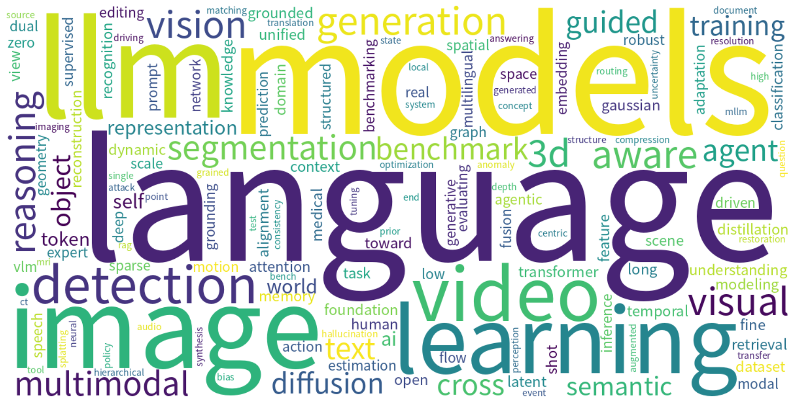

# Monthly arXiv Review — August 2026

**Period:** 2026-08-01 to 2026-08-31  
**Total papers:** 3392  
**Active weeks:** 5  

---

## 📈 Paper Volume Ranking by Category

| Rank | Category | Papers | Share |
| ---: | -------- | -----: | ----: |
| 1 | cs.CV | 2081 | 61.4% |
| 2 | cs.CL | 1311 | 38.6% |

---

## ☁️ Research Hotspot Word Cloud

*The word cloud above visualizes the most frequently appearing research topics and concepts across all papers this month.*

---

## 📅 Weekly Hotspot Evolution

| Week | Papers | Top Research Topics |
| ---- | -----: | ------------------- |
| 2026-W32 | 1095 | 多模态嵌入与检索 · 图像生成与Transformer · 医学图像分析 · 大语言模型评估与基准 · AI安全与对齐 |
| 2026-W33 | 987 | 3D重建与视觉基准 · 不确定性估计与深度证据回归 · 时序Transformer与轻量级模型 · 测试时自适应与面部表情识别 · MoE模型token级监督分配 |
| 2026-W34 | 507 | 编码代理的检索策略与token效率 · 自解释潜在推理框架 · 智能体工作流令牌膨胀与成本优化 · 长上下文语言建模架构 · 持续学习中的灾难性遗忘分析 |
| 2026-W35 | 670 | 自动驾驶与运动规划 · 视频多模态大模型与压缩 · 生成式视频压缩 · LLM数字孪生与信息结构 · 外中心到内中心视频生成 |
| 2026-W36 | 133 | Efficient Decoding with ANN-based Token Selection · Multimodal Academic Reasoning Benchmarks · Adaptive Hate Speech Detection · Emotion and LLM Sycophancy · Synthetic Finger Vein Data Generation |

---

## 🤖 AI-Generated Monthly Trend Analysis

# 2026年8月arXiv论文月度趋势分析

## 一、本月研究全景概览

2026年8月，arXiv共收录论文3392篇，其中计算机视觉（cs.CV）以2081篇的绝对优势领跑，占总量逾六成；自然语言处理（cs.CL）以1311篇紧随其后，两大学科共同构成了本月研究的核心版图。从周度分布来看，研究热度呈现显著的前重后轻格局：W32（1095篇）与W33（987篇）贡献了本月过半的论文量，W34与W35维持中位水平，而W36骤降至133篇，或反映学者在月末阶段性收束与会议截稿周期的影响。

## 二、核心研究趋势与热点

**多模态与生成模型持续领跑。** 多模态嵌入与检索、图像生成与Transformer在月初即成为焦点，视频多模态大模型与生成式视频压缩在W35进一步深化，显示出从静态图像向动态视频理解与高效表征的清晰迁移路径。

**医学影像与AI安全构成双轮驱动。** 医学图像分析贯穿全月，伴随3D重建与视觉基准的兴起，医疗场景下的视觉理解正走向精细化；AI安全与对齐、LLM风险校准等议题的持续升温，则折射出社区对模型可信度与可控性的深层关切。

**高效化与轻量化成为主流叙事。** 从时序Transformer与轻量级模型、MoE模型的token级监督分配，到编码代理的token效率优化、LLM数字孪生的信息结构设计，研究者普遍致力于在保持性能的前提下降低计算与推理成本，这已成为当前AI工程化的核心诉求。

## 三、周度演进脉络：从基础架构到场景落地

本月研究呈现出一条**“基础构建—效率优化—场景深化—前沿探索”**的清晰演进路径。

- **W32（基础构建期）**：聚焦多模态嵌入、图像生成与安全对齐，为全月研究奠定底层框架。
- **W33（能力拓展期）**：转向3D重建、时序建模与测试时自适应，标志研究视角从静态任务向动态、不确定性场景延伸。
- **W34（效率攻坚期）**：围绕token效率、长上下文建模与灾难性遗忘展开，研究者集中攻克大模型在规模扩展中的结构性瓶颈；阿拉伯语大模型的开发亦体现了语种多样性的关注。
- **W35（场景落地期）**：自动驾驶、视频压缩与数字孪生成为主角，研究重心向产业应用倾斜，Gen Alpha心理健康与LLM风险校准则揭示了社会责任视角的融入。
- **W36（前沿探索期）**：论文量虽少但方向新颖——ANN-based token选择解码、多模态学术推理基准、情感与LLM迎合行为、合成指静脉数据等，均指向具体而微的创新切口。

## 四、值得关注的新兴方向

以下几个方向虽论文绝对数量不多，但发展势头值得重点关注：

**高效解码与检索增强生成。** 基于近似最近邻（ANN）的token选择策略试图从解码层面重构生成效率，与之相关的编码代理检索策略共同指向“检索-生成”深度融合的新范式。

**LLM情感与人格化研究。** 情感与LLM谄媚行为、Gen Alpha心理健康等议题将AI从工具理性拓展至情感计算与心理健康的交叉地带，预示着大模型社会嵌入研究的新维度。

**专用数据合成与垂直Agent。** 合成指静脉数据生成、面向特定出版商的网页提取Agent等研究，反映社区正从通用模型转向细分场景的数据工程与工具定制。

## 五、结语与展望

纵观本月arXiv论文，**“高效、可信、场景化”**构成了贯穿始终的三条主线：从视觉-语言的基础架构搭建，到面向效率与安全的结构性优化，再到垂直领域的深度落地，研究梯度层次分明、生态日趋成熟。值得警惕的是，cs.CV与cs.CL的压倒性占比在一定程度上挤压了交叉学科的可见度，跨领域研究的声量仍待提升。

展望未来，随着月末前沿探索方向的逐步积累，**高效解码、情感计算与垂直Agent**有望在下月形成更具规模的专题集群。大模型研究正从“能力验证”阶段迈向“精耕细作”的新周期，如何在性能、效率与社会价值之间取得平衡，或将成为未来数月arXiv社区的核心命题。

---

*Generated automatically on 2026-09-01 09:39 UTC*